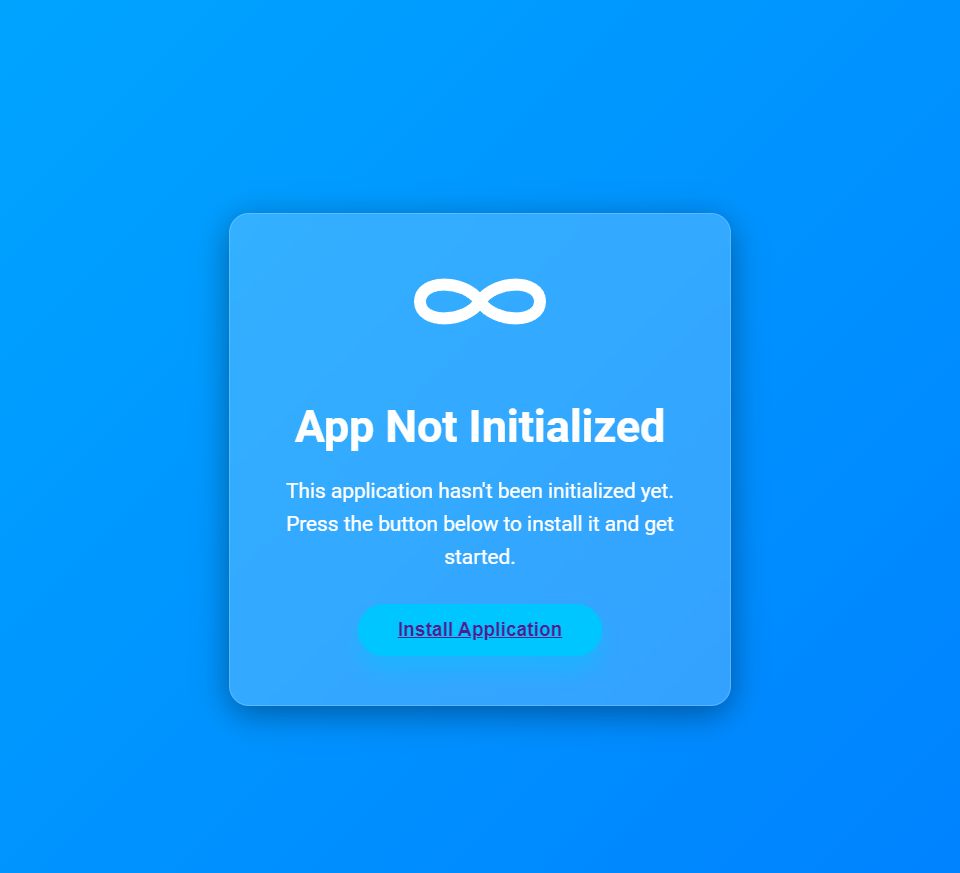
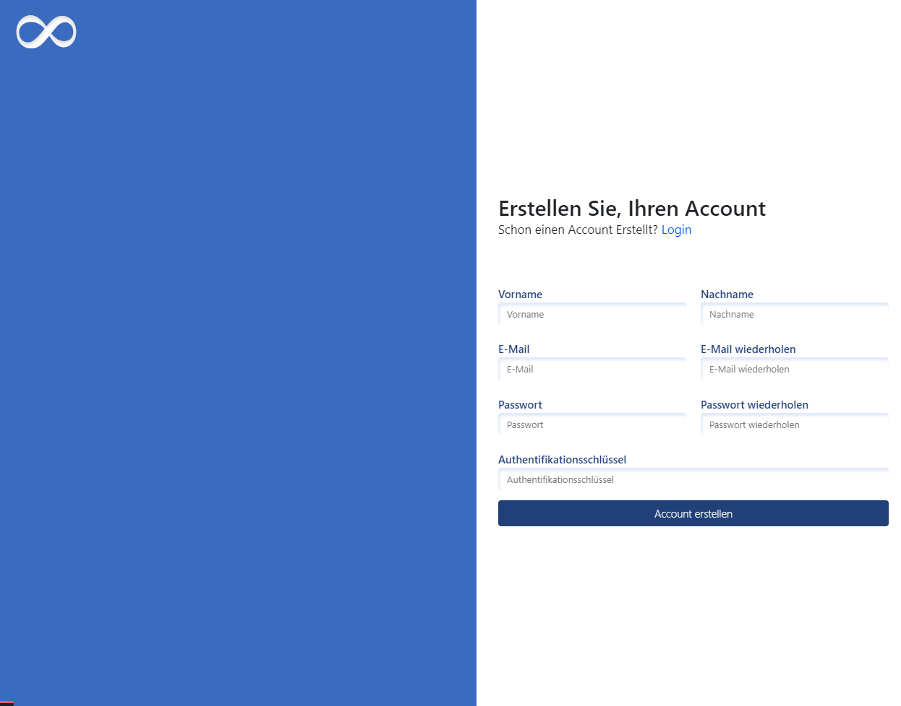
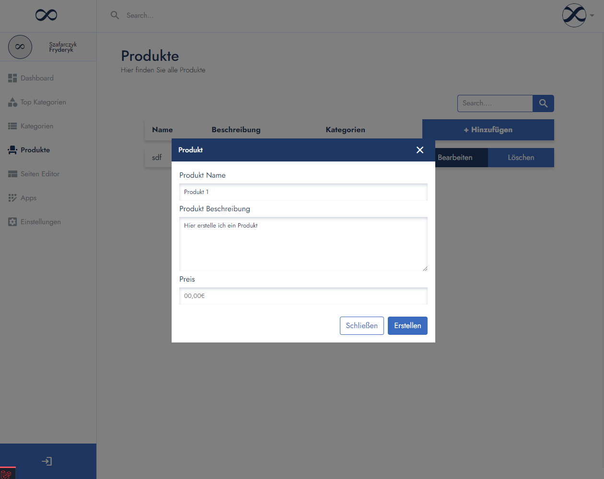
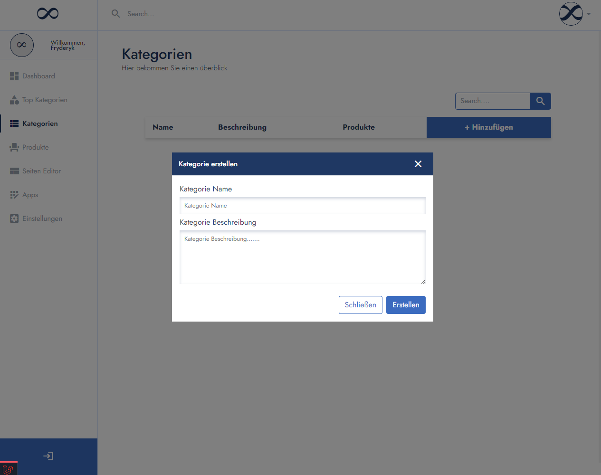

# Laravel CMS Project | OWN-CMS | V 0.0.2

This is a Content Management System (CMS) built using the Laravel framework. It provides a user-friendly interface for managing website content, including categories, products, and settings for both users and companies.

## Tech Stack

This CMS project is built with the following technologies:

- **Laravel**: As the main framework for web development, providing structure and routing.
- **PHP**: The backend language used for handling requests and business logic.
- **jQuery/ES6**: Used for DOM manipulation and handling AJAX requests for dynamic UI interactions.
- **SCSS**: All styles are written in SCSS (Sassy CSS), a powerful CSS preprocessor, making the styles modular and easier to maintain.

## Project Status: 🚧 60% Complete

This CMS project is currently under development and approximately 60% complete. Some features are functional, but the project is still being improved and refined. Contributions and feedback are welcome!

## Main-Features

- Homepage and product viewing for visitors.
- User and company registration and login.
- Admin dashboard for managing users, products, and categories.
- Product and category management with AJAX support for relationships.
- Site content management (homepage, about page).
- Over-category system for advanced categorization.
- Secure installation process with an auth key requirement.
- More soon

## Requirements

- PHP 8.1 or higher
- Composer
- Laravel 10
- MySQL or another supported database

## Installation Preview | When the Web Site is not init.

## Login System

## Register System

## Create Product

## Category Creation

## Category Product Relations
Here is an example video for the relation between categories and products:

