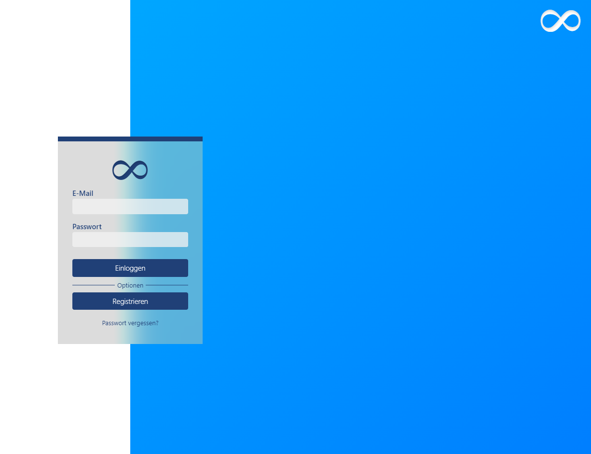

# Laravel CMS Project | OWN-CMS | V 0.0.2

This is a Content Management System (CMS) built using the Laravel framework. It provides a user-friendly interface for managing website content, including categories, products, and settings for both users and companies.

## Main-Features

- Homepage and product viewing for visitors.
- User and company registration and login.
- Admin dashboard for managing users, products, and categories.
- Product and category management with AJAX support for relationships.
- Site content management (homepage, about page).
- Over-category system for advanced categorization.
- Secure installation process with an auth key requirement.
- More soon

## Requirements

- PHP 8.1 or higher
- Composer
- Laravel 10
- MySQL or another supported database

## Installation Preview

## Login System

## Register System

## Create Product

## Category Creation

## Category Product Relations
Here is an example video for the relation between categories and products:

